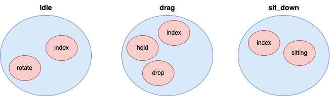

# bevy_baby

[itch.io](https://notelm.itch.io/bevy-baby)

> [!CAUTION]
> This crate is in an early stage of development and may undergo breaking changes.

## **Overview**

**bevy_baby** is a desktop mascot application built using [Bevy](https://github.com/bevyengine/bevy), a fast and
lightweight game engine written in Rust that utilizes the **ECS (Entity Component System) architecture**.

- Supports **VRM** ([VRM 1.0](https://vrm.dev/en/vrm1/)) and **VRMA animations** ([VRMA](https://vrm.dev/en/vrma/)).
- Enables **animation retargeting** across multiple models, leveraging Bevy's ECS efficiency.
- Designed for **Bevy users** and those interested in VRM-based animation workflows.

🚀 **This project also showcases my Bevy libraries!**

If you're using Bevy or planning to start, check them out:

| Library              | Description                | Link                                                       |
|----------------------|----------------------------|------------------------------------------------------------|
| **bevy_flurx**       | Provides coroutine support | [GitHub](https://github.com/not-elm/bevy_flurx)            | 
| **bevy_webview_wry** | Enables WebView in Bevy    | [GitHub](https://github.com/not-elm/bevy_webview_projects) |

---

## **Purpose & Goals**

This project was started as a **learning initiative** for:

- Bevy and ECS architecture
- Blender-based VRM model handling
- VRM animation techniques (VRMA)

Since I'm learning VRM from scratch, **some implementations might not be optimal**. Contributions and feedback from
experts are highly appreciated!

---

## **Supported Platforms**

Currently, **Windows is supported**, and macOS support is planned.

| Platform   | Status              |
|------------|---------------------|
| ✅ MacOS    | Supported           |
| ⚠️ Windows | Partially Supported |

### 🚨 **Windows Support Note**

On Windows, due to bug in `winit` or `wgpu`,
it is currently not possible to create a transparent window with backends both `vulcan` and `dx12`.

This application uses `open-gl` to avoid this bug, but on some devices, the application may crash during rendering.

---

## **Installation & Usage**

🚧 **Coming soon...**

---

## **Animation Actions & Transitions**

This application uses **animation actions** to define different mascot behaviors.  
Each action belongs to a **group**, and animations are stored in `assets/animations`.

📂 Example:

```
assets/animations/
├── idle/
│ ├── idle_1.vrma
│ ├── idle_2.vrma
├── drag/
│ ├── drag_start.vrma
│ ├── drag_loop.vrma
```

➡️ **Each directory is an action group**, and the `.vrma` files inside define individual actions.



### **Action Transition Types**

Actions can transition between each other using different transition modes:

| Transition Type | Description                                                       |
|-----------------|-------------------------------------------------------------------|
| **auto**        | Transitions to another action in the same group after a set time. |
| **manual**      | Transitions to a specified action after playing.                  |
| **none**        | No transition (stays in the current action).                      |

🎛️ **How to Configure Transitions**

- You can change action transitions **from the settings menu**.
- Open the menu by **right-clicking on the mascot**.

---

## **Future Plans (TODO)**

### **📌 Planned Features**

- [ ] **Complete Documentation**
- [ ] **Local HTTP Server for External Control**
- [ ] **Enhanced Action System** (scale changes, additional movements)
- [ ] **Support Look At retargeting**

### **📡 Local HTTP Server**

- Implement a **local HTTP server** to allow external applications to control mascot actions.
- Example: **Twitch API integration** to trigger animations based on chat events.

---

## **Using Custom VRM Models**

By default, **VRM models and animations (VRMA) are exported from Blender**.  
However, **VRM models exported from Unity may have different coordinate systems or bone structures**, causing unexpected
deformations.

### **How to Export from Blender**

To ensure compatibility, **export VRM models using Blender** with the following add-ons:

- [VRM Add-on for Blender (EN)](https://vrm-addon-for-blender.info/en/)
- [VRM Add-on for Blender (JP)](https://vrm-addon-for-blender.info/jp/)

---

## **Credits**

- [VRM Sample Model](https://vroid.pixiv.help/hc/ja/articles/4402394424089-AvatarSample-A-Z)
- Character animation credits to **pixiv Inc.'s VRoid Project**

---

## **License**

This project is released under the **MIT License**.

---

## **Contact**

📢 **For questions & contributions:**

- **Discord:** `@not_not_elm`