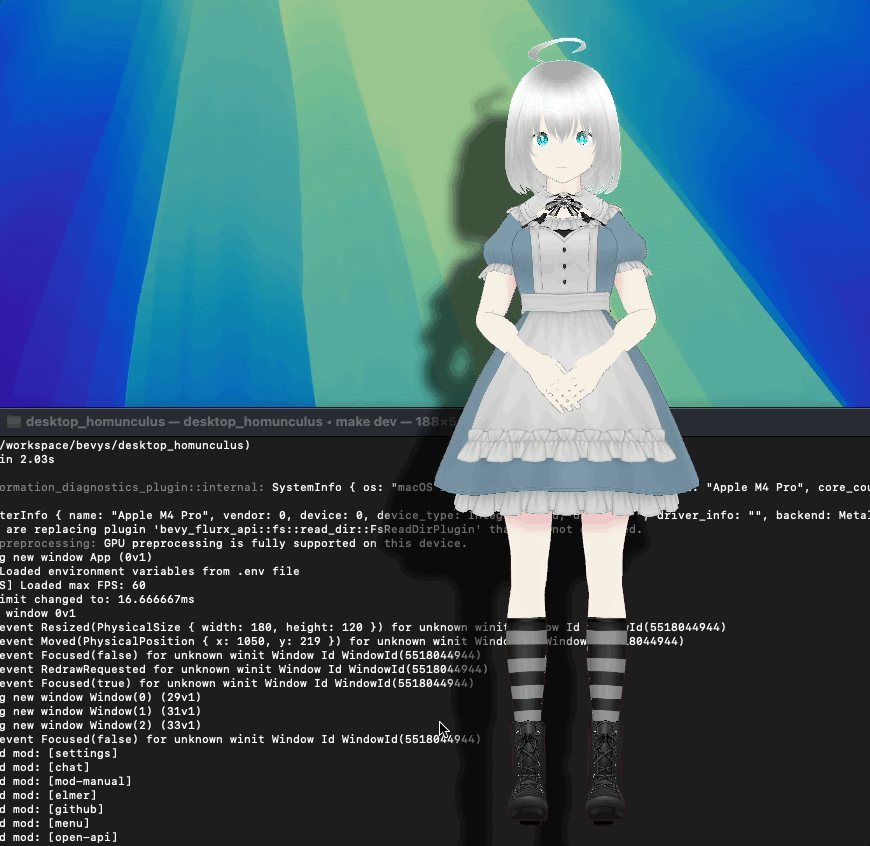

# Desktop Homunculus 🧬


**A Cross-Platform Desktop Pet Application with AI-Powered Characters**

Bring your desktop to life with intelligent 3D VRM characters that can chat, react, and evolve alongside your workflow.
Desktop Homunculus transforms your computer into an interactive companion experience powered by cutting-edge web
technologies and AI integration.

https://github.com/user-attachments/assets/7ff08d8b-845a-4199-baff-6abc49081b68

Transition smoothly to drag animations.


Sitting on the window will make it sit down.



When you right-click on a character, a menu appears.
You can customize this menu freely using MODs.


You can also chat with your character.
Also, you can use [VoiceVox](https://voicevox.hiroshiba.jp/) to enable speech synthesis.(Japanese only)


## ✨ Key Features

### 🤖 **AI-Powered Chat Integration**

- **ChatGPT Integration**: Engage in natural conversations with your desktop mascot
- **[VoiceVox Support](https://voicevox.hiroshiba.jp/)**: Characters can speak with realistic Japanese voice synthesis
- **Lip Sync Animation**: Watch your character's mouth move naturally when speaking
- **Custom System Prompts**: Define unique personalities and behaviors for each character

### 🎭 **Advanced VRM Character System**

- **Multiple VRM Models**: Deploy multiple 3D characters simultaneously across your desktop
- **[VRMA Animation Support](https://vrm.dev/en/vrma/)**: Create custom animations and emotional expressions
- **Multi-Monitor Support**: Characters can roam freely across all your displays
- **Custom Avatars**: Import and create your own VRM models and animations

### 🔌 **Extensible MOD System**

- **TypeScript SDK**: Build powerful extensions using modern web technologies
- **HTTP API**: Integrate with external applications via REST endpoints (localhost:3100)
- **Custom Interfaces**: Create floating HTML/CSS/JavaScript UI components
- **Script Automation**: Run JavaScript automation scripts for complex behaviors
- **Real-time Communication**: Event-driven architecture for responsive interactions

### ⚡ **Power Efficient Design**

- **Framerate Optimization**: Dynamic FPS limiting to conserve battery life

### 🌐 **Developer-Friendly Architecture**

- **Bevy Game Engine**: Built on Rust's high-performance ECS architecture
- **WebView Integration**: Embed modern web UIs directly in 3D space
- **Cross-Platform**: Primary support for macOS, with Windows compatibility
- **Modular Plugin System**: Clean separation of concerns for easy contribution

## 🚀 Installation

### Quick Start

Download the latest release from:

- [itch.io](https://notelm.itch.io/desktop-homunculus)

### Development Setup

```bash
# Clone the repository
git clone https://github.com/your-repo/desktop_homunculus.git
cd desktop_homunculus

# Install dependencies
make setup

# Run in development mode
make dev
```

## ⚙️ Configuration

### ChatGPT Integration Setup

To enable AI chat functionality, configure your OpenAI API key using one of these methods:

#### Method 1: Environment File

Create `assets/.env` and add:

```.env
OPENAI_API_KEY=your_openai_api_key_here
```

#### Method 2: System Environment (macOS)

```bash
# Set the environment variable system-wide
launchctl setenv OPENAI_API_KEY your_openai_api_key_here
```

### VoiceVox Integration

1. Download and install [VoiceVox](https://voicevox.hiroshiba.jp/)
2. Launch VoiceVox before starting Desktop Homunculus
3. Characters will automatically gain speech capabilities with synchronized lip movements

## 🎯 Use Cases

- **Coding Companion**: Get coding advice and rubber duck debugging assistance
- **Productivity Assistant**: Set reminders, display notifications, and manage tasks
- **Language Learning**: Practice conversations in Japanese with native voice synthesis
- **Entertainment**: Interactive desktop pets with personality and humor
- **Workflow Enhancement**: Custom automations and desktop organization tools

## 🛠️ Development Commands

```bash
# Core development
make dev                    # Run with development features
cargo run --features develop  # Alternative development command

# Building
pnpm build                  # Build TypeScript frontend components
cargo build                 # Build Rust components

# Quality assurance
make fix                    # Auto-format and fix linting issues
cargo test --workspace     # Run Rust tests
pnpm check-types           # TypeScript type checking
```

## 🌍 Platform Support

| Platform   | Status              | Notes                                           |
|------------|---------------------|-------------------------------------------------|
| ✅ macOS    | Fully Supported     | Primary development platform                    |
| ⚠️ Windows | Partially Supported | Requires OpenGL due to transparency limitations |
| 🔄 Linux   | Planned             | Future release target                           |

> [!WARNING]
> **Windows Compatibility Note**: Due to limitations in `winit`/`wgpu`, Windows requires OpenGL rendering for proper
> transparency. This may cause stability issues on some graphics configurations.

## 🐛 Known Issues

- [ ] [Window background covered in black on Windows 11 with RTX](https://github.com/not-elm/desktop_homunculus/issues/9)
- [ ] [Animation transition breaks with different initial VRM poses](https://github.com/not-elm/bevy_vrm1/issues/32)

## 🗺️ Roadmap

### Priority Features

- [ ] Complete Windows platform support
- [ ] MOD Registry for easy extension sharing
- [ ] English language VRM speech support
- [ ] Enhanced multi-language AI personalities

### Future Enhancements

- [ ] Cloud sync for character configurations
- [ ] Mobile companion app
- [ ] Advanced facial expression recognition
- [ ] Community character marketplace

## 🤝 Contributing

We welcome contributions! See [CONTRIBUTING.md](./CONTRIBUTING.md) for detailed guidelines on:

- Application development and bug fixes
- VRM/VRMA animation contributions
- UI/UX improvements
- MOD development and SDK enhancements
- Documentation updates

## 📄 License

This project is licensed under **LGPL-3.0-only**.

## 🙏 Credits

- Built with [Bevy Game Engine](https://bevyengine.org/)
- CI/CD powered by [bevy_game_template](https://github.com/NiklasEi/bevy_game_template)
- VRM support via [bevy_vrm1](https://github.com/not-elm/bevy_vrm1)
- Voice synthesis by [VoiceVox](https://voicevox.hiroshiba.jp/)

---

**Ready to bring your desktop to life?** Download Desktop Homunculus today and create your own AI-powered digital
companion!


