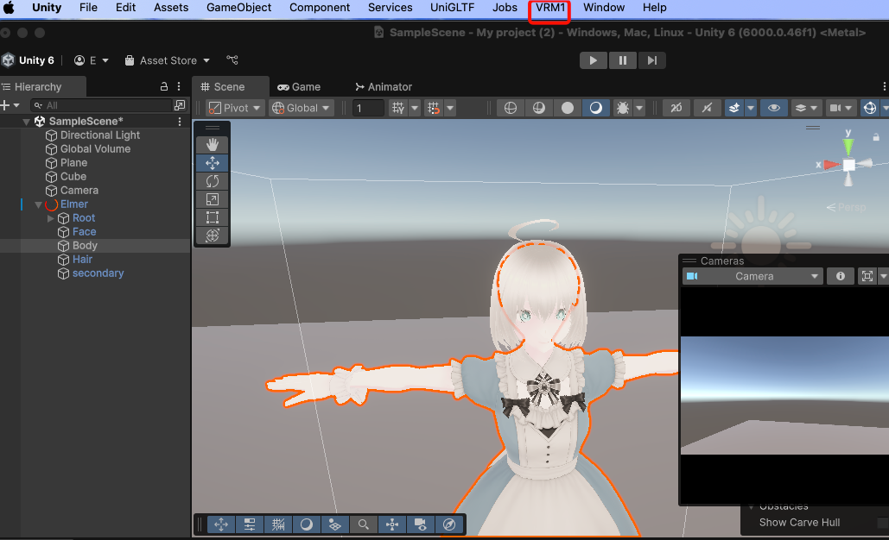
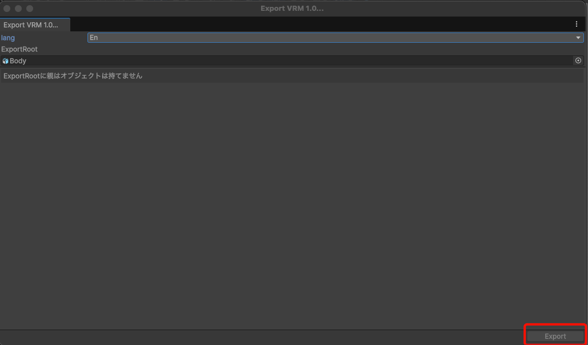

# How to Convert VRM0.X to VRM1.0

VRM comes in two versions: `0.X` and `1.0`, and this application only supports `1.0`.
This section explains how to convert from `0.X` to `1.0`.

## Install Unity

Please install the latest version of [Unity Hub](https://docs.unity3d.com/hub/manual/InstallHub.html).

## Install UniVRM

Install the latest version of [UniVRM](https://github.com/vrm-c/UniVRM/releases).

## Convert VRM0 to VRM1

Click on `VRM1` after selecting the VRM you want to convert.

Selecting `Export VRM1` from the menu displays the following dialog.
Click `Export`, and then simply follow the prompts to complete the export.

