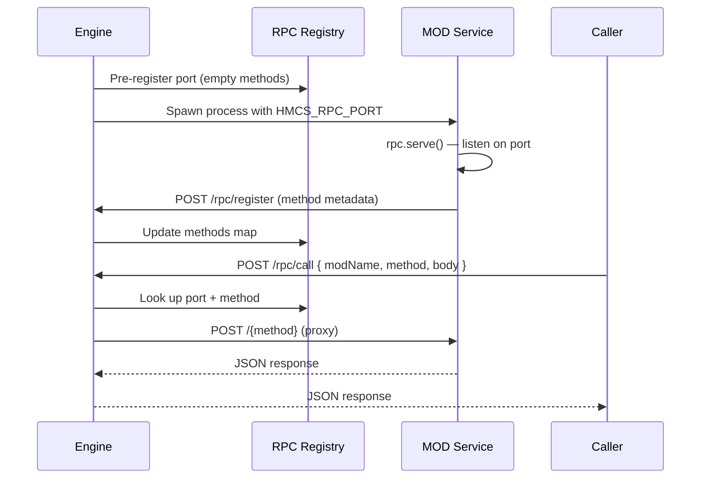

# RPC

The RPC system lets MOD services expose stateful HTTP methods that the engine, other MODs, and AI agents can call through a central proxy. Unlike MOD commands (one-shot `bin` scripts), RPC methods run inside the MOD's long-running service process, giving them access to in-memory state.

To define and serve RPC methods from a MOD service, see the [rpc SDK module](/reference/sdk/rpc).

## How It Works

The engine allocates an ephemeral port and pre-registers it in the RPC registry before spawning the MOD process. The MOD service reads the port from `HMCS_RPC_PORT`, starts an HTTP server with [`rpc.serve()`](/reference/sdk/rpc/serve), and calls `POST /rpc/register` to publish its methods. Registration returns 404 if no pre-allocated port exists for the MOD.

## Environment Variables

The engine sets these environment variables when spawning a MOD service:

| Variable        | Description                                                                                                                                            |
| --------------- | ------------------------------------------------------------------------------------------------------------------------------------------------------ |
| `HMCS_RPC_PORT` | Port the MOD service must listen on (allocated by the engine)                                                                                          |
| `HMCS_MOD_NAME` | MOD package name                                                                                                                                       |
| `HMCS_PORT`     | Engine HTTP API port. Not explicitly set by the engine — the SDK falls back to `3100` if unset. Only needed if the engine runs on a non-standard port. |

## Error Handling

Error codes returned by `POST /rpc/call`:

| Status | Meaning                                                                                                                   |
| ------ | ------------------------------------------------------------------------------------------------------------------------- |
| 503    | MOD not registered (not yet started or crashed)                                                                           |
| 404    | Unknown method. During the pre-registration phase (before the MOD calls `/rpc/register`), all method names are forwarded. |
| 504    | Timeout exceeded (default 30 s, or per-method `timeout` if set)                                                           |
| 502    | Connection refused (MOD service unreachable)                                                                              |
| 500    | Internal error                                                                                                            |

## Calling RPC Methods

| Method   | Description               | Reference                                             |
| -------- | ------------------------- | ----------------------------------------------------- |
| MCP Tool | `call_rpc` for AI agents  | [MCP Reference](../reference/mcp-tools/rpc)           |
| HTTP API | `POST /rpc/call` endpoint | [REST API Reference](../reference/api/call) |

## See Also

- [rpc SDK module](/reference/sdk/rpc) — Server-side API for defining and serving RPC methods
