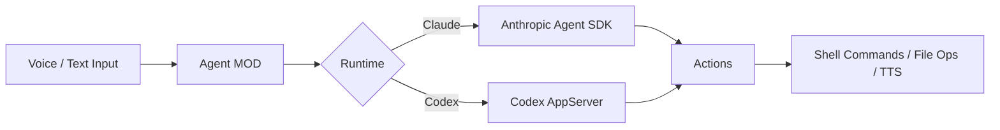

# @hmcs/agent

The AI Agent MOD (`@hmcs/agent`) enables personas to act as autonomous AI agents. Each persona can accept voice or text input, reason about your workspace, and execute actions — powered by Claude or Codex.

## Overview

The Agent MOD connects to one of two AI runtimes:

- **Claude** — Via the Anthropic Agent SDK. Requires an Anthropic API key.
- **Codex AppServer** — Via OpenAI's Codex. Runs shell commands and file operations within a managed environment.

When a session is active, the agent can read workspace files, run shell commands, manage git worktrees, and speak responses via TTS.

## Prerequisites

Install the Agent MOD:

```shell
hmcs mod install @hmcs/agent
```

Optional companion MODs:

| MOD | Purpose |
|-----|---------|
| `@hmcs/stt` | Voice input via Push-to-Talk |
| `@hmcs/voicevox` | Text-to-speech responses with lip sync |

## Features

### Agent Session

Start an agent session from the **right-click menu** → **"Agent"**. The Session HUD opens, showing:

- Real-time agent reasoning steps and log output
- Speech-to-text transcripts (when STT is active)
- Permission request prompts for sensitive operations

### Workspace Management

The agent manages git worktrees within configured workspace directories:

- List and select available worktrees
- Track changes and detect orphaned worktrees
- Session working directory stored at `{workspace}/.hmcs/worktrees/{worktreeName}/`

### Session Log Persistence

Agent sessions are logged per persona and git branch:

```
{workspace}/.hmcs/agent-logs/{personaId}/{branchName}/{sessionUuid}.jsonl
```

Previous session context is automatically injected into subsequent sessions on the same branch, enabling continuity across conversations.

### Permission Sound Effect

When the agent requests user permission for sensitive operations (e.g., running a destructive command), an audio cue plays. This is configurable per-persona via `metadata['permission-se']` — set it to any sound asset ID.

## Settings

Access agent settings from the **right-click menu** → **"Agent"** → settings panel.

Settings are stored per-persona in preferences at key `agent::{personaId}`:

| Setting | Description |
|---------|-------------|
| Runtime | Claude SDK or Codex AppServer |
| API Key | Anthropic API key (Claude runtime only) |
| Workspaces | Workspace directory paths |
| Worktree | Active worktree selection within a workspace |
| PTT Key | Global keyboard shortcut for Push-to-Talk (e.g., Ctrl+Shift+Space) |
| Max Tokens | Maximum response tokens |
| Temperature | Model temperature |

## How It Works



1. User provides input via PTT (voice → STT transcription) or text
2. Agent builds a system prompt from the persona's identity, personality, and workspace context
3. The AI runtime reasons and produces tool calls
4. Actions are executed (shell commands, file operations, MOD commands)
5. Results are displayed in the Session HUD and optionally spoken via VoiceVox

## Notes

- The Agent MOD is an independent MOD that *uses* the persona system — it is not built into the persona itself.
- Each persona can have its own agent configuration (different runtime, API key, workspace).
- Session logs use JSONL format for efficient append-only storage.
