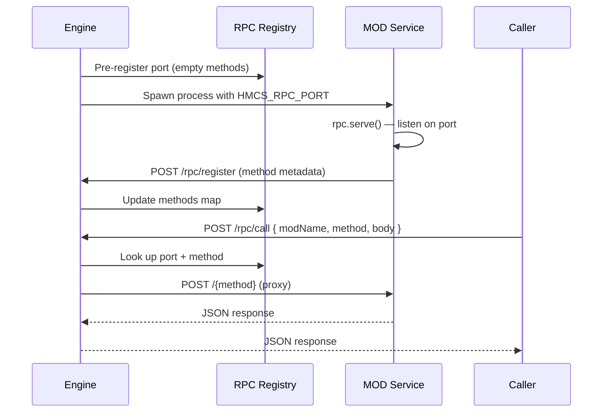

# RPC

RPC システムにより、MOD サービスはステートフルな HTTP メソッドを公開でき、エンジン、他の MOD、AI エージェントが中央プロキシを通じて呼び出すことができます。MOD コマンド（ワンショットの `bin` スクリプト）とは異なり、RPC メソッドは MOD の長時間実行サービスプロセス内で動作するため、インメモリ状態にアクセスできます。

MOD サービスから RPC メソッドを定義・提供する方法については、[rpc SDK モジュール](/reference/sdk/rpc)を参照してください。

## 仕組み

エンジンはエフェメラルポートを割り当て、MOD プロセスを起動する前に RPC レジストリに事前登録します。MOD サービスは `HMCS_RPC_PORT` からポートを読み取り、[`rpc.serve()`](/reference/sdk/rpc/serve) で HTTP サーバーを起動し、`POST /rpc/register` を呼び出してメソッドを公開します。MOD に事前割り当てされたポートが存在しない場合、登録は 404 を返します。

## 環境変数

エンジンは MOD サービスの起動時に以下の環境変数を設定します：

| 変数 | 説明 |
| --------------- | ------------------------------------------------------------------------------------------------------------------------------------------------------ |
| `HMCS_RPC_PORT` | MOD サービスがリッスンするポート（エンジンが割り当て） |
| `HMCS_MOD_NAME` | MOD パッケージ名 |
| `HMCS_PORT`     | エンジン HTTP API ポート。エンジンからは明示的に設定されません — SDK は未設定の場合 `3100` にフォールバックします。エンジンが非標準ポートで動作している場合にのみ必要です。 |

## エラー処理

`POST /rpc/call` が返すエラーコード：

| ステータス | 意味 |
| ------ | ------------------------------------------------------------------------------------------------------------------------- |
| 503    | MOD が未登録（まだ起動していないかクラッシュした） |
| 404    | 不明なメソッド。事前登録フェーズ中（MOD が `/rpc/register` を呼び出す前）は、すべてのメソッド名が転送されます。 |
| 504    | タイムアウト超過（デフォルト 30 秒、またはメソッドごとの `timeout` が設定されている場合はその値） |
| 502    | 接続拒否（MOD サービスに到達不能） |
| 500    | 内部エラー |

## RPC メソッドの呼び出し

| メソッド | 説明 | リファレンス |
| -------- | ------------------------- | ----------------------------------------------------- |
| MCP Tool | AI エージェント向け `call_rpc` | [MCP リファレンス](../reference/mcp-tools/rpc) |
| HTTP API | `POST /rpc/call` エンドポイント | [REST API リファレンス](../reference/api/call) |

## 関連項目

- [rpc SDK モジュール](/reference/sdk/rpc) — RPC メソッドの定義と提供のためのサーバーサイド API
